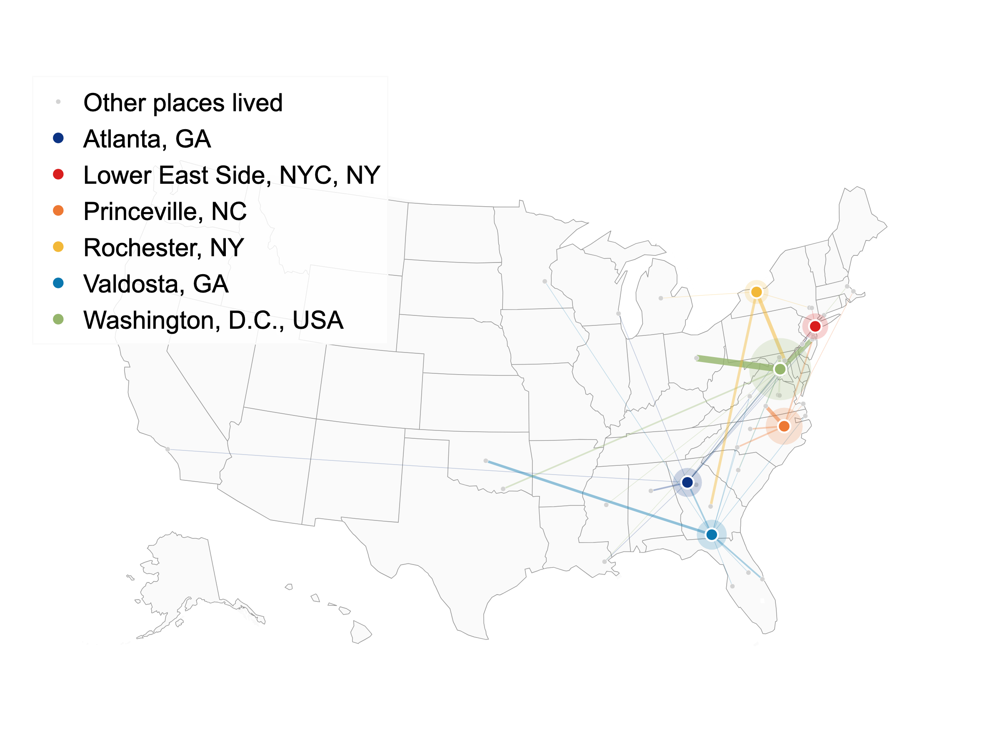
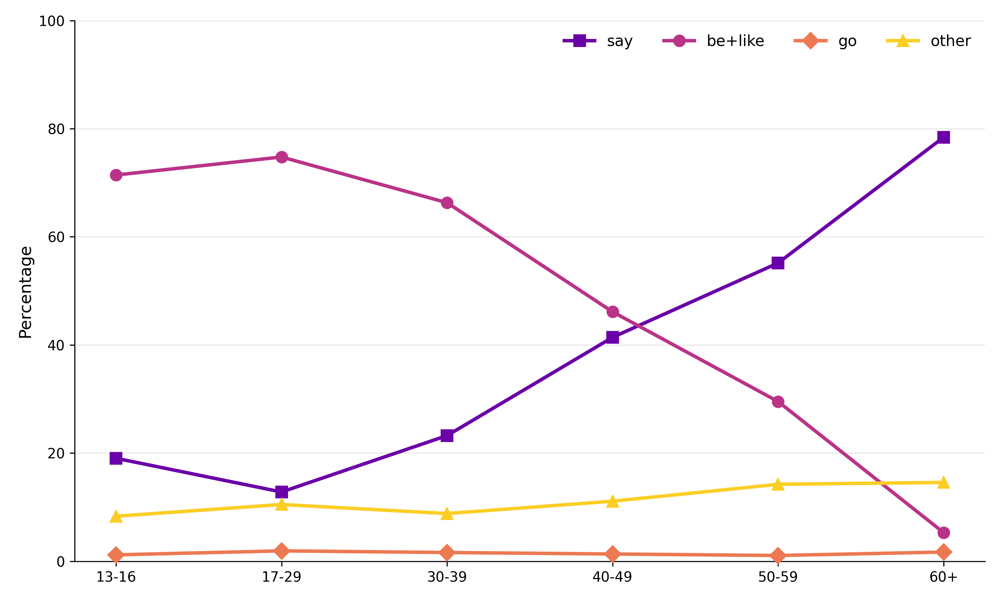
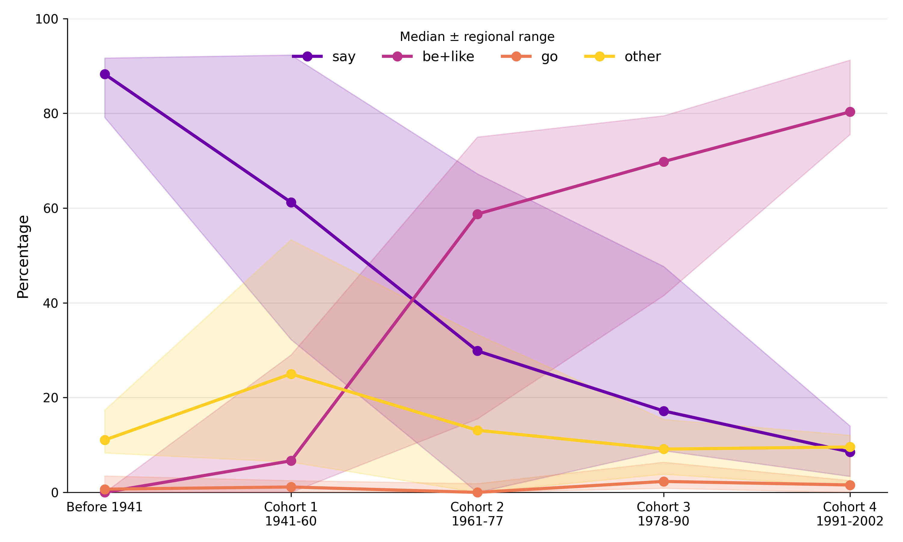
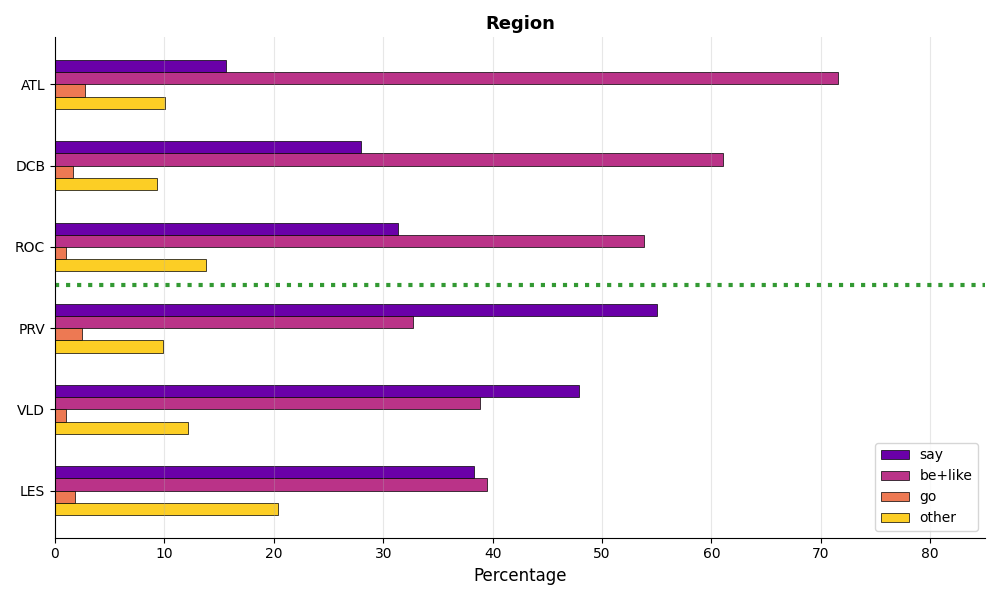
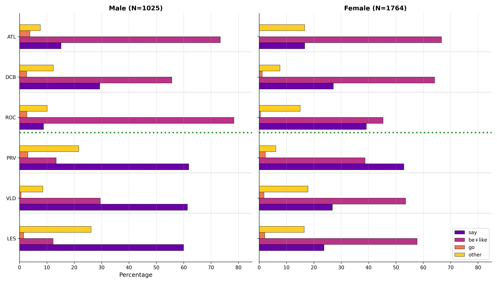
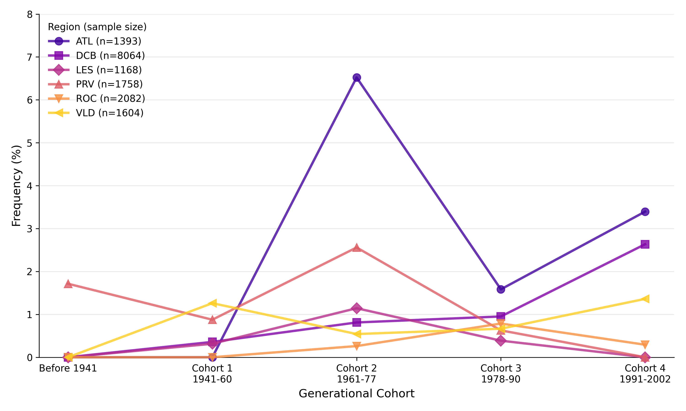
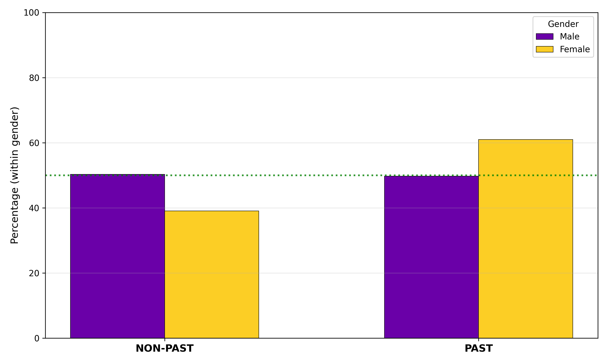
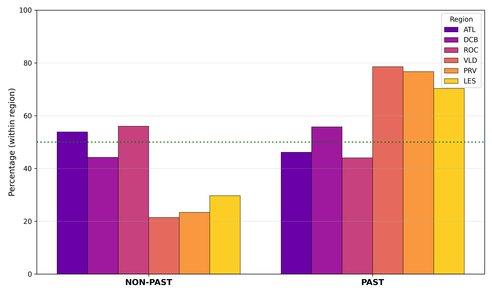
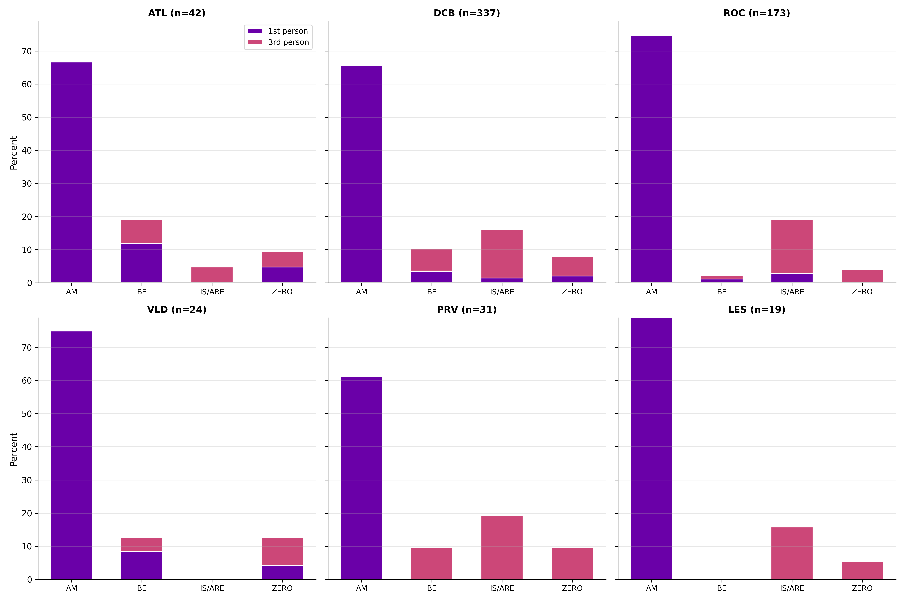

# LING 532 term project
An investigation of quotative constructions in the Corpus of Regional African 
American Language (CORAAL).

## Requirements
Required packages for data vizualization can be installed by running 
`pip install -r requirements.txt`

## Directory Structure

`...` indicates non-empty directories.

```cmd
.
├── config
│   └── patterns.yaml
├── copula_analysis.ipynb
├── copula.py
├── data
│   ├── ATL_metadata_2020.05.txt
│   ├── ATL_textfiles_2020.05
│   │   ├── ...
│   ├── DCB_metadata_2018.10.06.txt
│   ├── DCB_textfiles_2018.10.06
│   │   ├── ...
│   ├── geocode_cache.json
│   ├── LES_metadata_2021.07.txt
│   ├── LES_textfiles_2021.07
│   │   ├── ...
│   ├── PRV_metadata_2018.10.06.txt
│   ├── PRV_textfiles_2018.10.06
│   │   ├── ...
│   ├── ROC_metadata_2020.05.txt
│   ├── ROC_textfiles_2020.05
│   │   ├── ...
│   ├── VLD_metadata_2021.07.txt
│   ├── VLD_textfiles_2021.07
│   │   ├── ...
├── feature_extraction.ipynb
├── grammaticalization_by_age.ipynb
├── grammaticalization_by_gender.ipynb
├── grammaticalization_by_region.ipynb
├── LICENSE
├── migration_analysis.ipynb
├── output
│   ├── ...
├── preprocess.py
├── q_system_analysis.ipynb
├── README.md
├── requirements.txt
└── viz
    ├── ...
```

## Data Preprocessing
This stage requires 2 inputs:
1. filepath to plaintext transcripts of CORAAL interview data, under `data/<LOCALE>`
2. filepath to inflected quotative construction components, under `config/`

The plaintext transcripts are wrangled into `pandas` `Dataframe` objects with columns:

|  name  |  source  |
|---|---|
|  `source_file`  |  copied from filename  |
|  `speaker_id`  |  copied from transcript  |
|  `utterance`  |  copied from transcript  |
|  `utt_id`  |  utterance position within interview transcript |
|  `region_id`  | configured separately  |
|  `q_type`  |  labeled in the YAML  |
|  `target`  |  regular expression capture group  |

### Quotative filtering
As attested by Barbieri (2005) and Cukor-Avila (2012), the first aspect of the data to target is whether a transcripted utterance contains a quotative form with the following lemmas:
 - *say*
 - *go*
 - *tell <(someone)>*
 - *yell*
 - *ask*
 - *repeat*
 - *think*
 - *(be) all*
 - *(be) like*

A manual analysis of regular expression matches indicates that there are two quotative contexts which we can examine with this transcript data:
 - before ","
 - before interjections (a pre-defined set)

The `utterance` column of the preprocessed `Dataframe` is filtered by the presence of a quotative form. A new column, `target`, is filled with the sub-string of `utterance` which has been matched against a relevant quotative inflected form. Another new column, `q_type` is mapped to the relevant quotative lemma form. 

### Copula filtering
As attested by Cukor-Avila (2012), general frequency of characteristic AAE copula
forms helps to characterize the expected grammaticalization of *be like* as
a component of AAE copula systems. Implemented in `copula.py` to filter for any
instances of copula immediately after a pronoun subject.

## Quantitative Analysis

This stage requires a plaintext CORAAL metadata file in addition to the preprocessed utterance-level data points. The extracted quotative utterances can now be analyzed for correlation with sociolinguistic variables and relative frequencies across all quotative productions.

### Independent variable(s)
Correlational and frequency analyses are performed with respect to the following independent variables:
 - region
 - age (at interview)
 - year of birth (generational cohort)
 - gender

These independent/predictor variables are associated with different metadata details, configured in a separate CORAAL file. 

### Migration Analysis

Implemented in `migration_analysis.ipynb`. Extracts "migration paths" from the 
CORAAL metadata columns relating to speakers' previous and current place of 
residence. Irregular notes on *Other Places Lived* are ignored, unless very 
common (ex: `PG County`). The metadata info is split into lists of valid 
locations which are paired with each city associated with each subcorpus, 
representing the areas of influence on the variation captured at a specific 
locale. Halo size corresponds to the number of speakers participating from a 
certain region, while line thickness corresponds to the number of speakers who 
have been in contact with the regions indicated by the line before residing in 
their current place of residence.




### Quotative System Analysis

Implemented in `q_system_analysis.ipynb`. Visualizes whether AAE speakers 
represented in CORAAL are participating in the shift to allow *be like* as a 
quotative verb, modelled by the frequency of use by age/generational cohort.

Also computes Spearman correlation between age and *be like* frequency, as done
in previous research. Further expands this aggregate analysis by plotting the
regional "spread" of quotative frequency. This reveals that non-adjacent regions 
pattern with each other, further exacerbated by the partitioning of data by
speakers' genders.









### Copula System Analysis

#### Invariant *be* analysis
Instances of AAE invariant *be* are extracted from the `output/detected_copulas.csv` data. Though there appears to be an outlier in one of the region's 
generational cohorts, the overall usage patterns wwell with previous work in that
invariant *be* appears to generally have a low but consistent frequency. This
provides context for the grammaticalization of *be like* which may be more or 
less strongly correlated with speaker variables like gender (as in 
`grammaticalization_by_gender.ipynb`), or region (as in `grammaticalization_by_region.ipynb`).



Gender indeed appears to correlate with different grammaticalization patterns,
namely the use of non-past or past morphology with *be like*.



But what appears to have a stronger relationship with grammaticalization patterns
for usage of *be like* is geographical region, where regions with majority OR
minority populations of AAE speakers pattern together (VLD, PRV, and LES), while
regions with "competitive" populations of AAE speakers pattern together (ATL,
DCB, ROC).



Unlike morphological constraints shown above, the investigation of non-past 
morphological forms to visualize syntactic subject/inflection constraints shows 
the influence of geographical proximity taking over the influence of 
demographic proportions.

